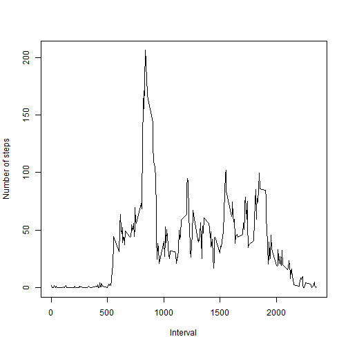

# Reproducible Research: Peer Assessment 1


## Loading and preprocessing the data


```r
dat<-read.csv("activity.csv")
```

## What is mean total number of steps taken per day?


```r
s<-tapply(dat$steps, dat$date, sum, na.rm=TRUE)
hist(s, xlab="Total number of steps taken each day", ylab="Frequency")
```

 

```r
mean(s, na.rm = TRUE)
```

```
## [1] 9354
```

```r
median(s, na.rm = TRUE)
```

```
## [1] 10395
```

Regarding total number of steps taken per day, the mean
value is 9354.2295 and
the median is 10395.

## What is the average daily activity pattern?


```r
m<-tapply(dat$steps, dat$interval, mean, na.rm=TRUE)
plot(dat$interval[1:(24*60/5)], m, type = "l", , xlab="Interval", ylab="Number of steps")
```

 

## Imputing missing values

###1. The total number of missing values in the dataset:


```r
na_steps <- nrow(dat[is.na(dat$steps),])
na_steps
```

```
## [1] 2304
```

###2. Filling in all of the missing values in the dataset:


```r
int_dat <- split(dat$steps, dat$interval)
int_mean <- sapply(int_dat, mean, na.rm=TRUE)
for(i in 1:nrow(dat)){
    if(is.na(dat$steps[i])){
        dat$steps[i] <- int_mean[as.character(dat$interval[i])]
    }
}
```

###3. A new dataset that is equal to the original dataset but with the missing data filled in:


```r
head(dat)
```

```
##     steps       date interval
## 1 1.71698 2012-10-01        0
## 2 0.33962 2012-10-01        5
## 3 0.13208 2012-10-01       10
## 4 0.15094 2012-10-01       15
## 5 0.07547 2012-10-01       20
## 6 2.09434 2012-10-01       25
```

###4. Histogram of the total number of steps taken each day:


```r
s<-tapply(dat$steps, dat$date, sum, na.rm=TRUE)
hist(s, xlab="Total number of steps taken each day", ylab="Frequency")
```

 

```r
mean(s, na.rm = TRUE)
```

```
## [1] 10766
```

```r
median(s, na.rm = TRUE)
```

```
## [1] 10766
```

These values differ from the estimates from the first part one.
Filling missing value makes the distribution of frequency near to normal distribution. 


## Are there differences in activity patterns between weekdays and weekends?


```r
library("timeDate")
dat$date2 <- factor(ifelse(isWeekday(as.Date(dat$date)), "weekday", "weekend"))
dat2<-split(dat,dat$date2)

st <- lapply(dat2, function (x) tapply(x[["steps"]], x[["interval"]], mean))
st2 <- c(st$weekday, st$weekend)
int2 <- rep(dat$interval[1:288], 2)
f2<-factor(rep(0:1, each = 288), labels = c("weekday", "weekend"))

library(lattice)
xyplot(st2 ~ int2 | f2, layout = c(1, 2), type = "l", xlab="Interval", ylab="Number of steps")
```

 
